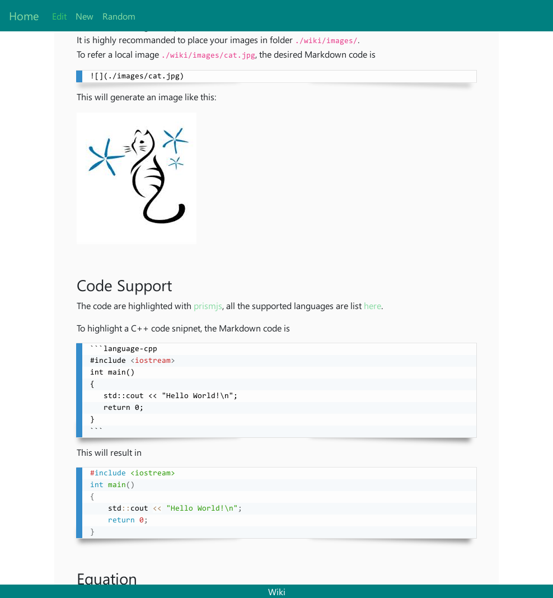

## Minimal Wiki

This wiki is designed to work with self-hosted knowledge management, i.e., all pages are located in a local folder `wiki`, and this fold is synchronised with a cloud-driver across different machines.

Usage:

```bash
git clone https://github.com/fengwang/minimal-wiki.git
cd minimal-wiki
virtualenv .
source ./bin/activate
pip3 install -r ./requirements.txt
pip3 install https://github.com/fengwang/markdown/archive/master.zip --upgrade
python3 ./wiki.py&
```

### Docker installation

1. build an docker image with name `c-wiki`:

```bash
git clone https://github.com/fengwang/minimal-wiki.git
cd minimal-wiki
docker build -t c-wiki .
```
2. run a container with name `wiki`, exposing port `8895` and storing wiki items folder `/cache/data/wiki` :

```bash
docker run -p 8895:8895 -v /cache/data/wiki:/wiki --name wiki -d c-wiki
```

3. copying starting file `home.md` and default folder `wiki/images` to `/cache/data/wiki`:
```bash
cp -r ./wiki /cache/data/wiki
```


### Features:

#### Integration of local images

Links to local images are possible.
It is highly recommanded to place your images in folder `./wiki/images/`.
To refer a local image `./wiki/images/cat.jpg`, the desired Markdown code is

```

```

<br>

#### Code Support

The code are highlighted with [prismjs](https://prismjs.com/), all the supported languages are list [here](https://prismjs.com/#languages-list).

To highlight a C++ code snipnet, the Markdown code is

    ```language-cpp
    #include <iostream>
    int main()
    {
       std::cout << "Hello World!\n";
       return 0;
    }
    ```

#### Equation

[MathJax](https://www.mathjax.org/) is employed to generate equations, example:

```language-none
\\[x = \\frac{-b \\pm \\sqrt{b^2-4ac} }{2a}\\]
```

And the inline equation  is generated via

```language-none
\\(x = \\frac{-b \\pm \\sqrt{b^2-4ac} }{2a}\\).
```


### Screenshot:



